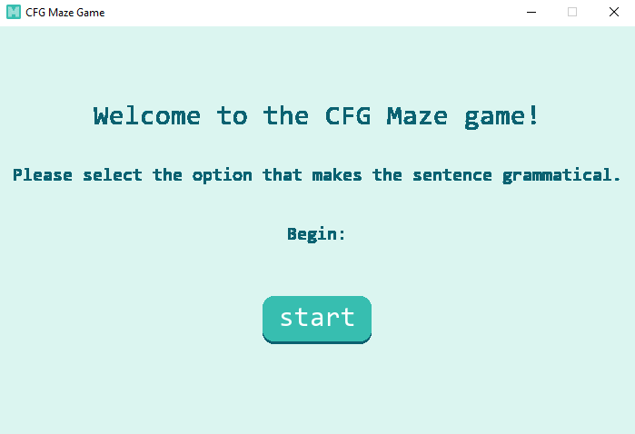
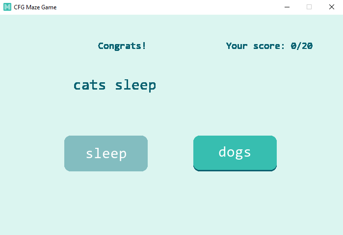
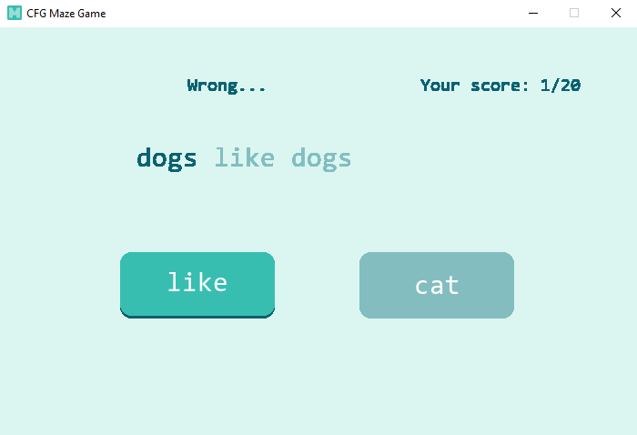

# CFG Maze game

A maze-task-like game with CFG sentence generator. 

## How to use

- cfg-maze.py: GUI version of the game. Run the python script and the game should start. 
- cfg-maze.ipynb: Console version of the game. With explanations, hopefully can be adapted to a student assignment/challenge. 

## Tips

Add more words to assets/cfg.csv to make the corpus larger.

## Screenshots

