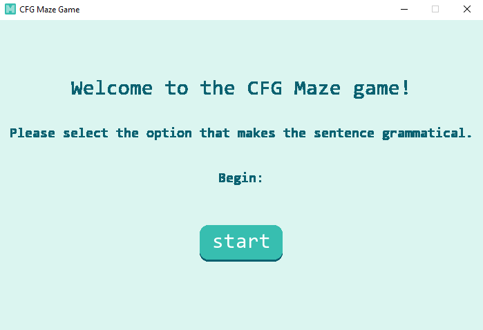
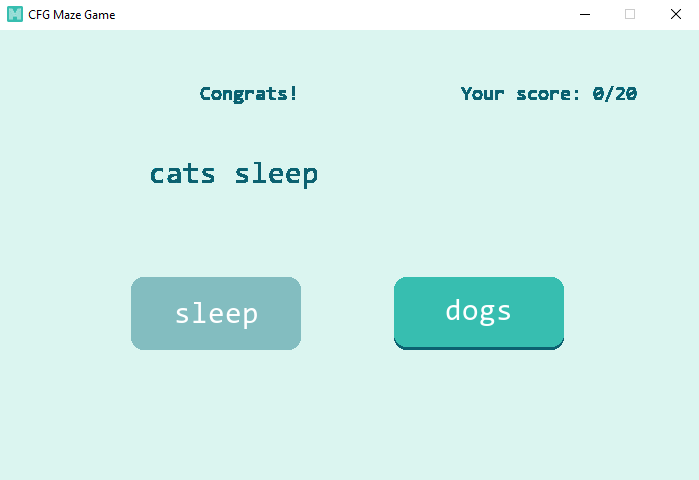
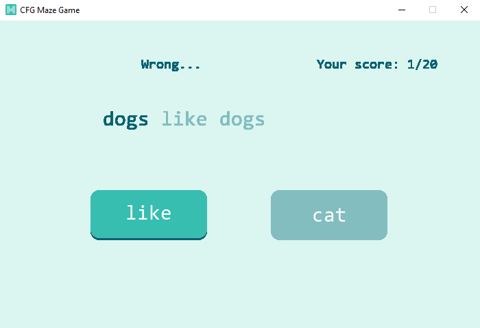

# CFG Maze game

A maze-task-like game with CFG sentence generator. 

## How to use

GUI version:
- Run from code:
    - cfg-maze.py: Requires `pygame` (install by running `pip install pygame`). Run the python script and the game should start. 
- Run executable (Windows only):
    - build.zip: Does NOT require Python or pygame. Simply download, unpack, run the executable and enjoy. 

Console version:
- cfg-maze.ipynb: Console version of the game. With explanations, hopefully can be adapted to a student assignment/challenge. 

## Tips

Add more words to `assets/cfg.csv` to make the corpus larger.

## Screenshots

